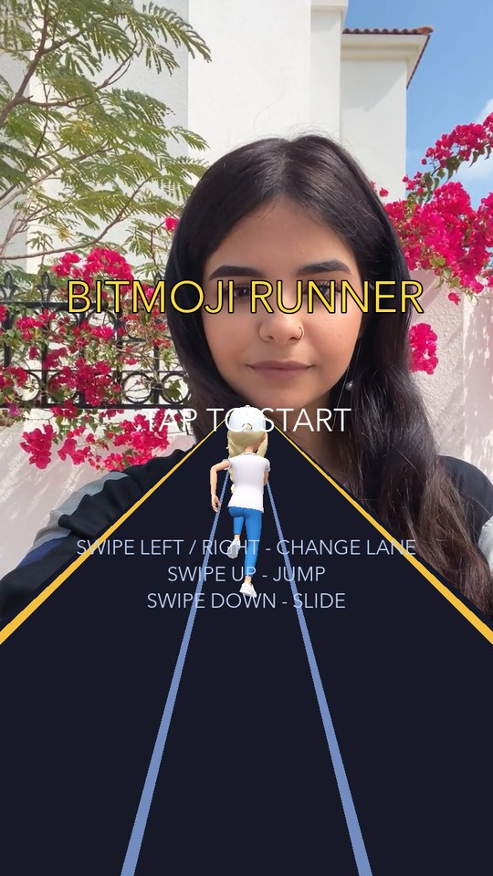
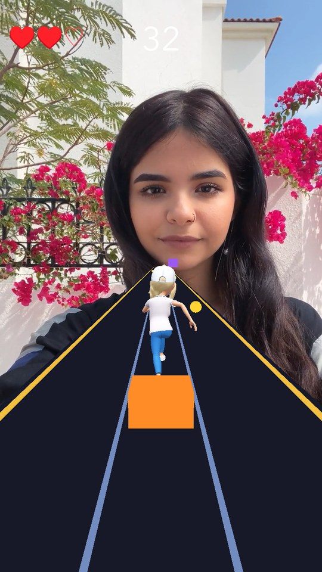
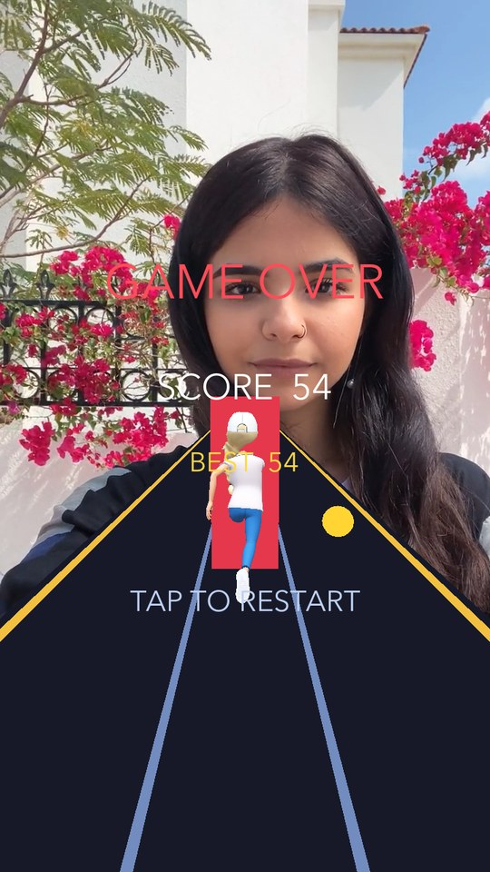

# Bitmoji Runner — тестове завдання (Interactive AR Game Developer)

Прототип нескінченного раннера для Lens Studio 5.23 (target: Snapchat, Mobile + CameraKit).
Bitmoji-персонаж біжить по трьох смугах, оминає перешкоди, збирає монетки; гра
прискорюється з часом, має три життя і рестарт без виходу з лінзи.

Кожна механіка перевірена запуском у Preview, а не лише прочитана очима — що саме
й як перевірялося, описано в розділі «Як перевірялося».

| Меню | Гра | Game Over |
|:---:|:---:|:---:|
|  |  |  |
| Назва, підказка старту<br>і нагадування про жести | Низька перешкода в центрі,<br>монетка праворуч.<br>У HUD життя (♥♥♡) і рахунок | Біг зупинено, персонаж<br>у позі очікування; рахунок,<br>рекорд і рестарт по тапу |

## Відповідність завданню

| Вимога | Стан |
|---|---|
| Bitmoji з анімаціями | біг + strafe-нахили при зміні смуги |
| Перешкоди, які можна оббігати й перестрибувати | три типи: стіна, низька, підвісна (+ підкат) |
| Зіткнення віднімає життя | з вікном недоторканності 0.9 с |
| Три колізії завершують гру | біг зупиняється, персонаж переходить у позу очікування; екран Game Over з рахунком і рекордом |
| Спосіб керування на вибір | свайпи + тап |
| Рестарт без виходу з лінзи | тап на екрані Game Over |
| Обʼєкти за бали + рахунок в UI | монетки (10) і час виживання (2/с), лічильник у HUD |
| Гра ускладнюється з часом | швидкість і щільність перешкод ростуть одночасно |
| Проєкт у Git-репозиторії | репозиторій ініціалізований, історія чиста |

## Керування

| Жест | Дія |
|---|---|
| Свайп вліво / вправо | Зміна смуги — оминути стіну |
| Свайп вгору | Стрибок — перестрибнути низьку перешкоду |
| Свайп вниз | Підкат — проїхати під підвішеною перешкодою |
| Тап | Старт і рестарт |

Свайпи обрані замість екранних кнопок, бо не займають простір над персонажем і є
звичним патерном жанру. Тап на екранах меню та Game Over — це старт/рестарт: окрема
кнопка нічого б не додала, бо інших дій там немає.

## Структура

```
Assets/Scripts/
  GameConfig.ts        — усі числа балансу в одному місці
  SwipeInput.ts        — тачі → 4 напрямки свайпу + тап
  PlayerController.ts  — смуги, стрибок, підкат, блендінг анімацій
  TrackItem.ts         — один обʼєкт доріжки + правило «чи вдалося ухилитись»
  TrackSpawner.ts      — пул обʼєктів, розклад спавну, перевірка зіткнень
  ScoreManager.ts      — рахунок (монетки + час), рекорд сесії
  UIManager.ts         — Menu / HUD / Game Over
  AudioManager.ts      — звуки подій гри, один play(Sfx)
  GameManager.ts       — стан-машина, життя, ріст складності, рестарт
```

Ієрархія сцени:

```
Camera Object            перспективна камера (0, 6, 36), нахил -6°
Lighting                 Envmap + Directional
Game                     [GameManager]
├── Player               [PlayerController]  — рухається по X (смуга) і Y (стрибок)
│   └── Bitmoji          [Bitmoji 3D, AnimationPlayer] — візуал, стискається в підкаті
├── Ground / LaneLine_L,R / Rail_L,R         — доріжка й розмітка
├── Track                [TrackSpawner]
│   ├── Templates        4 вимкнені шаблони (барʼєр / низька / підвісна / монетка)
│   └── Pool             24 клони, створені кодом на старті
├── Audio                [AudioManager] — звуки збирає з власних нащадків
│   └── SFX_Coin / SFX_Hit / SFX_Jump / SFX_Slide / SFX_Lane
└── UI                   [UIManager]
Orthographic Camera → Canvas → Full Frame Region
└── UI_Menu / UI_HUD / UI_GameOver
```

## Рішення, які варто пояснити

**Один «хаб» замість павутиння.** `GameManager` — єдиний скрипт, який знає про решту.
Гравець, спавнер, UI і звук одне про одного не знають. Граф залежностей лишається
деревом, і будь-який шматок можна замінити, не чіпаючи інші.

**Звʼязування — на `OnStartEvent`, не на `onAwake`.** Lens Studio будить скрипти згори
вниз по ієрархії, тому на момент `onAwake` у `GameManager` (він на батьківському
обʼєкті) дочірні компоненти ще не існують як TS-обʼєкти. Виклик їхнього методу падає
з `undefined is not a function`. `OnStart` гарантує, що всі `onAwake` відпрацювали.

**Зіткнення рахуються кодом, а не фізичними колайдерами.** На максимальній швидкості
(250 см/с) обʼєкт долає ~8 см за кадр при 30 FPS, тож тонкий колайдер можна проскочити
між кадрами. Перевірка «та сама смуга + відстань по Z» детермінована, не залежить від
FPS і легко дебажиться. Тип перешкоди задає й спосіб ухилитись — це одне місце в коді
(`TrackItem.isNotAvoided`), а не розмазана по проєкту логіка.

**Пул замість create/destroy.** Створення SceneObject під час гри дає помітний фрейм-дроп
на мобільному рантаймі. 24 обʼєкти клонуються один раз на старті з чотирьох шаблонів
у сцені, далі лише вмикаються й вимикаються. Шаблони вимкнені — це «форма для відливки».

**Пул створюється кодом, а не руками в редакторі.** Спавнер приймає чотири шаблони й сам
робить копії через `copyWholeHierarchy`. Інакше в інспекторі довелося б звʼязувати два
десятки обʼєктів — довго і легко помилитись.

**Анімації зібрані кодом замість Animation State Manager.** У туторіалі Snap ASM
налаштовується десятком полів у редакторі (стани, переходи, blend tree, параметри).
Те саме тут робить `AnimationClip.createFromAnimation` + ваги кліпів: `Run` завжди на
повну як база пози, `Left`/`Right Strafe` домішуються рівно настільки, наскільки
персонаж зміщується вбік. Менше конфігурації, поведінка видима прямо в коді.

**Поза очікування зібрана з того, що є.** Готового Idle-кліпа для цього рига немає:
Mixamo-набір з туторіалу — це лише `Fast Run` і два strafe, а компонент `Bitmoji 3D`
вміє тільки `default` і `bodyTracking`. Просто зупинити всі кліпи не можна — з
нульовими вагами риг падає в bind-позу, тобто в T-позу. Тому Idle — це зупинений
кадр бігу (`playbackSpeed = 0` на моменті, де ноги зведені, а корпус вертикальний)
плюс легке «дихання» синусом по вертикалі. Без дихання персонаж читається як зламана
модель, а не як той, хто чекає. Кадр і амплітуда винесені в `GameConfig`.

**Перешкоди їдуть у бік `+Z`.** У Lens Studio `-Z` — це «вперед», а камера стоїть на
`z=36` позаду гравця. Обʼєкти народжуються на `z=-280` і рухаються до камери.

**`TrackItem` — звичайний клас, а не компонент.** Якби кожна перешкода була
`ScriptComponent`, пул довелося б збирати в редакторі. Тут сцена лишається чистою.

**`ScoreManager` не має залежностей від сцени** — це єдина частина гри, яку можна
покрити unit-тестом, не запускаючи Lens Studio.

**Усі команди руху повертають `boolean`.** `jump()` і `slide()` ігноруються, якщо інша
дія вже триває; `moveLeft()`/`moveRight()` — якщо гравець уже скраю. Звук у таких
випадках грати не можна: він брехав би про стан гри, клацаючи без жодного руху на
екрані. Тому `PlayerController` повідомляє, чи дія справді почалася, а `GameManager`
вирішує, чи озвучувати її. Напрямок залежностей не змінився — гравець як і раніше
нічого не знає про звук.

**`AudioManager` не має жодного `@input`.** Замість поля й методу на кожен звук —
один `play(Sfx)` і словник, який компонент збирає сам, обходячи власних нащадків:
ключ береться з імені обʼєкта, `SFX_Coin` → `Sfx.Coin`. Додати звук — це покласти
обʼєкт під `Audio` і дописати рядок в enum; ані входів, ані нових методів.

Плата — звʼязок з іменами в сцені: перейменування могло б вимкнути звук мовчки. Тому
`onAwake` звіряє сцену з enum і друкує, для яких подій звуку немає і які звуки не мають
події. Сам `play()` на невідому подію мовчить — гра не повинна падати через неозвучену дію.

**Звук перезапускає доріжку, а не чекає її кінця.** Монетки йдуть щільно, і якщо просто
викликати `play()`, поки попередній звук ще звучить, виклик ігнорується — половина
підборів лишається без фідбеку. `AudioManager` спершу зупиняє доріжку, потім грає заново.

## Баланс

Уся складність — у `GameConfig.ts`, щоб її можна було крутити без читання логіки.
Ростуть два параметри одночасно: швидкість (110 → 250 см/с) і щільність перешкод
(інтервал 1.35 → 0.55 с). Обидва впираються в стелю — без неї гра стає нечесною,
а не складною.

Рахунок росте з двох джерел: монетки (активна дія) і час виживання (винагорода за
дистанцію). Друге потрібне, щоб обережна гра теж мала сенс.

Після зіткнення діє 0.9 с недоторканності — широка перешкода перекриває гравця кілька
кадрів поспіль, і без цього три життя зникали б за мить.

Спавнер не кладе монетку в смугу, куди щойно пішла перешкода: інакше гра карала б
за те, що сама ж і заохочує. Побічний ефект — нерухомий гравець у центрі майже не
збирає монеток, і це радше плюс: рух вигідніший за стояння.

## Ассети

Bitmoji-персонаж, Mixamo-анімації (`Fast Run`, `Left Strafe`, `Right Strafe`) і
`Bitmoji 3D` узяті з офіційного туторіал-проєкту Snap «Part 1 — Bitmoji Runner Game».
Файли скопійовані разом з `.meta`, щоб зберегти GUID-и — інакше посилання на кліпи
анімацій розʼїхались би при реімпорті.

Звуки — з пакета **UI SFX Pack** з Asset Library: `bubble_high` (монетка),
`bubble_low` (зіткнення), `tap_jump` (стрибок), `bubble_mid` (підкат),
`tap_click1` (зміна смуги). Три «bubble» дають узгоджену трійцю за висотою тону:
високий — нагорода, середній — ухилення, низький — помилка. Клац зміни смуги
навмисно тихіший (`volume 0.6`), бо лунає найчастіше і не має заглушати решту.
Решта звуків пакета зі сцени видалені.

Решта — доріжка, розмітка, перешкоди, монетки, UI — зроблена в цьому проєкті
примітивами й Unlit-матеріалами.

## Як перевірялося

Механіки міряні в рантаймі, а не оцінені на око:

| Що | Очікувано | Факт |
|---|---|---|
| Зміна смуги | `x = 9` (права смуга) | `x = 9` |
| Стрибок | пік = `CONFIG.jumpHeight` = 15 см | 15.0 см |
| Підкат | `0.15 × 0.45` | `scaleY = 0.068` |
| Свайп угору двічі за 120 мс | один звук (стрибок ще триває) | один |
| Свайп уліво тричі поспіль | один звук (далі край доріжки) | один |
| Усі пʼять звуків | спрацьовують на своїх подіях | усі пʼять |
| «Дихання» в позі очікування | коливання в межах ±0.35 см | -12.28 → -11.97 |

Три помилки знайшлися лише запуском — не читанням коду:

1. **Порядок ініціалізації.** `GameManager` на батьківському обʼєкті прокидається
   раніше за дочірні, тож у `onAwake` методи `TrackSpawner` ще не існують.
2. **Шар екранного UI.** Текст має бути і під `Canvas → Full Frame Region`, **і** на
   шарі `1048576`. Без другої умови його малює основна перспективна камера як 3D-обʼєкт:
   на екрані величезний білий прямокутник поверх сцени.
3. **Орієнтація примітива.** Меш площини вже лежить у XZ, тож «правильний» поворот
   на -90° ставив землю на ребро, і вона зникала з кадру.
4. **Персонаж висів над доріжкою.** Висоту я підібрав по bind-позі, але анімація бігу
   тримає модель вище — вийшов зазор у ~8 см. На екрані це читалось як «персонаж і
   перешкоди летять у повітрі повз трасу»: на висоті персонажа рейлінги, що лежать на
   землі й сходяться до горизонту, проходять ближче до центру, тож він здавався за
   межами доріжки. Локалізував двома контрольними кубиками, покладеними просто на
   землю в крайніх смугах: вони лягли симетрично й усередині рейлінгів — отже проблема
   була у висоті персонажа, а не в ширині чи асиметрії траси.

## Що свідомо не робив

- **Немає збереження рекорду між сесіями.** Рекорд живе в межах сесії лінзи; для
  міжсесійного потрібен Persistent Storage Module, а в завданні цього не було.
- **Немає партиклів і фонової музики.** Звук є лише на пʼяти ігрових подіях.
- **Перешкоди — примітиви, не моделі.** Форма читається (стіна / низька / підвісна),
  а час пішов у геймплей і структуру.
- **Немає прогресії складності за «рівнями»** — лише плавний лінійний ріст.

## Запуск

Відкрити `SplendidscoreTeskTask.esproj` у Lens Studio 5.23.2+, натиснути Preview.
Bitmoji підтягується автоматично для залогіненого розробника.
